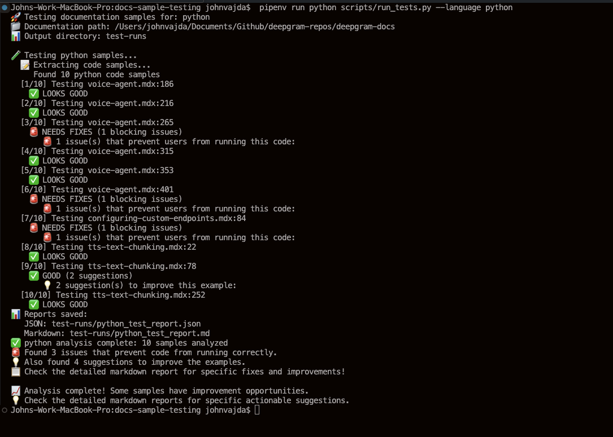

# Deepgram SDK Code Sample Documentation Testing Framework

A language-agnostic framework for analyzing code samples in SDK documentation to find outdated patterns, missing imports, and improvement opportunities.

## 🎯 What This Framework Does

- **Extracts code samples** from MDX documentation files
- **Analyzes content patterns** to find outdated SDK usage and common issues
- **Identifies blocking problems** like missing imports, wrong API patterns, syntax errors
- **Suggests specific improvements** with exact fixes and file:line references
- **Generates actionable reports** that help documentation teams prioritize fixes
- **Scales to hundreds of samples** across multiple documentation files without execution complexity

## 🚀 Quick Start

### Clone & Install

```bash
# Clone and setup
git clone https://github.com/deepgram/docs-sample-testing.git
cd docs-sample-testing
pipenv install


```bash
# Test the framework setup
pipenv run python scripts/run_tests.py --help
```

### Configure Your SDK & Docs Paths

   ```bash
   # Copy the example configuration
   cp local_paths.yaml.example local_paths.yaml
   ```
Then edit `local_paths.yaml` with your actual paths to the SDKs and Docs directories.


### Run Commands

   ```bash
   # Test Python samples
   pipenv run python scripts/run_tests.py --language python

   # Test all supported languages
   pipenv run python scripts/run_tests.py --all-languages

   # Override paths if needed (optional)
   pipenv run python scripts/run_tests.py --language python --docs-path /different/path
   ```

### A Typical Testing Workflow

1. **Run Analysis**: `pipenv run python scripts/run_tests.py --language python`
2. **Review Markdown Report**: Open `test-runs/python_test_report.md` for detailed findings
3. **Fix Blocking Issues First**: Address high-impact problems that break user experience
4. **Implement Improvements**: Apply suggestions to enhance documentation quality
5. **Re-run Analysis**: Verify fixes and track progress

## 💡 Recommended Cursor Directory Structure

Based on which SDK code samples you want to test and update you can use the following structure in Cursor.

```
your-cursor-workspace/
├── docs-sample-testing/          # This repo
├── deepgram-docs/                # Documentation repo
├── deepgram-python-sdk/          # Python SDK repo
├── deepgram-js-sdk/              # JavaScript SDK repo
└── deepgram-go-sdk/              # Go SDK
└── deepgram-dotnet-sdk/          # .NET SDK
```

## 📋 How to Use the Results

### Understanding the Analysis Output

**Terminal Output:**



## 📊 Reports Generated

### JSON Report (`test-runs/{language}_test_report.json`)
- Machine-readable analysis results
- Complete findings data for further processing
- Sample metadata and validation results

### Markdown Report (`test-runs/{language}_test_report.md`)
- **Human-readable analysis summary**
- **Organized by issue type** (Outdated SDK Import, Missing Import, etc.)
- **Specific file:line references** for each issue
- **Exact fix instructions** for every problem found
- **Prioritized next steps** based on blocking vs. improvement issues
- **Perfect for documentation teams** to systematically address issues

**Example Report Structure:**

```markdown
## 🚨 Blocking Issues (Fix These First)
### Outdated SDK Import (v2/v3) (15 samples)
**`migrating-from-assembly-ai.mdx:42`** - Import statement
- Problem: Uses completely outdated import: from deepgram import Deepgram
- Fix: Change to: from deepgram import DeepgramClient
- Impact: Users will get ImportError - this class no longer exists
```

## 🔧 How It Works

### 1. **Configuration**
- **Global settings** in `config/framework_config.yaml` (file patterns, output formats)
- **Language-specific rules** in `config/languages/{lang}.yaml` (SDK patterns, known issues)

### 2. **Sample Extraction**
- Parses MDX files to find code blocks by language tag (`\`\`\`python`, `\`\`\`javascript`, etc.)
- Preserves original code content for accurate pattern analysis
- Identifies different sample types and contexts

### 3. **Content Analysis**
- **Pattern matching** for outdated SDK imports and API usage
- **Missing dependency detection** for common libraries and modules
- **Best practice analysis** for API key handling, error patterns, etc.
- **No code execution** - pure static analysis for reliability

### 4. **Actionable Reporting**
- **Blocking issues**: Problems that prevent users from running code
- **Improvement suggestions**: Ways to enhance documentation quality
- **Specific fixes**: Exact changes needed with file:line references
- **Prioritized recommendations**: Focus on high-impact issues first

## 🔮 Multi-Language Architecture

The framework is designed for easy expansion to other languages:


### Directory Structure

``` bash
docs-sample-testing/
├── README.md                          # This documentation
├── config/
│   ├── framework_config.yaml          # Global settings (timeouts, paths, etc.)
│   └── languages/
│       ├── python.yaml                # Python SDK v5 patterns & validations
│       ├── javascript.yaml            # JavaScript config (placeholder)
│       ├── go.yaml                    # Go config (placeholder)
│       └── csharp.yaml                # C# config (placeholder)
├── core/
│   └── base_executor.py               # Abstract base class for language executors
├── languages/
│   ├── python/
│   │   └── executor.py                # Python-specific test execution logic
│   ├── javascript/
│   │   └── executor.js                # JavaScript executor (placeholder)
│   ├── go/
│   │   └── executor.go                # Go executor (placeholder)
│   └── csharp/
│       └── executor.py                # C# executor wrapper (placeholder)
├── scripts/
│   └── run_tests.py                   # Main test runner
├── samples-to-fix/
│   └── sample_files_to_fix.md         # History of SDK samples fixes made in Docs
└── test-runs/                         # Generated test reports (created on run)
```

### Ready for Extension:
- **JavaScript/TypeScript**: Config file ready, executor placeholder in place
- **Go**: Config file ready, executor placeholder in place
- **C#/.NET**: Config file ready, executor wrapper in place
- **Any language**: Follow the same pattern using `base_executor.py`

### Adding a New Language:
1. **Create config**: `config/languages/{lang}.yaml` with patterns and rules
2. **Implement executor**: `languages/{lang}/executor.{ext}` following `base_executor.py` interface
3. **Test**: Run `scripts/run_tests.py --language {lang}`

## 📚 Documentation Files Preserved

- `python-samples/python_samples_to_fix.md` - Complete record of Python SDK v5 migration work

